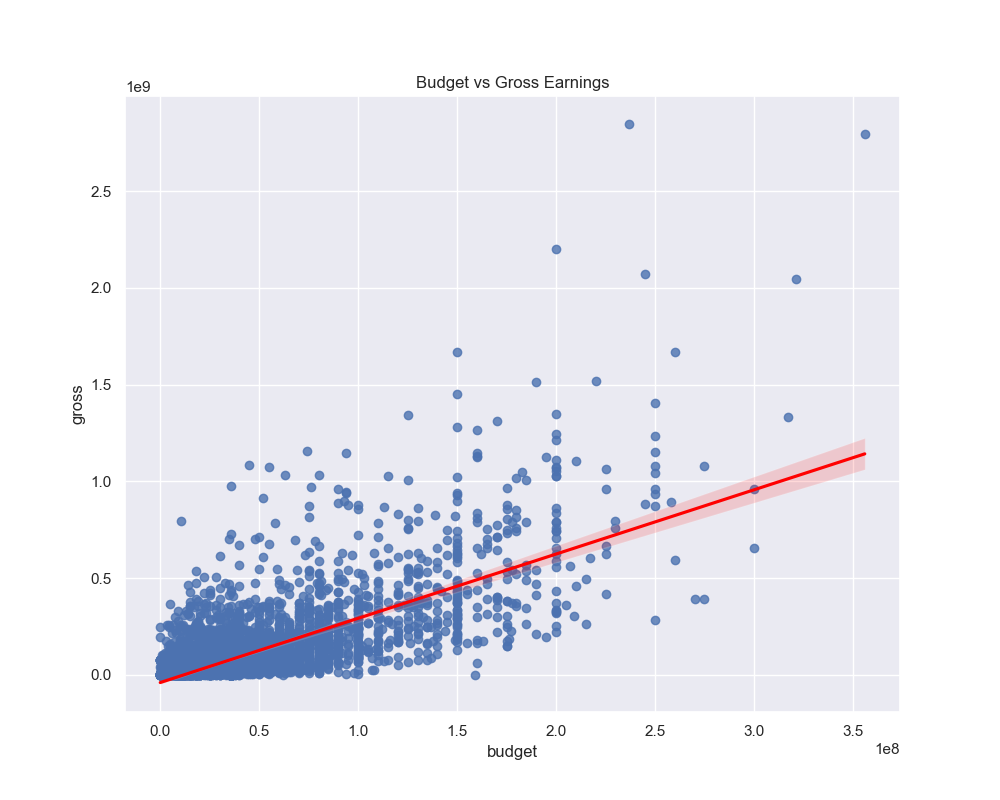
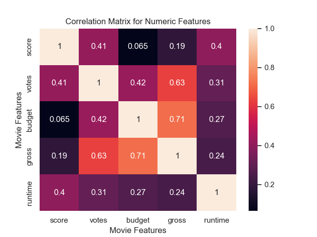
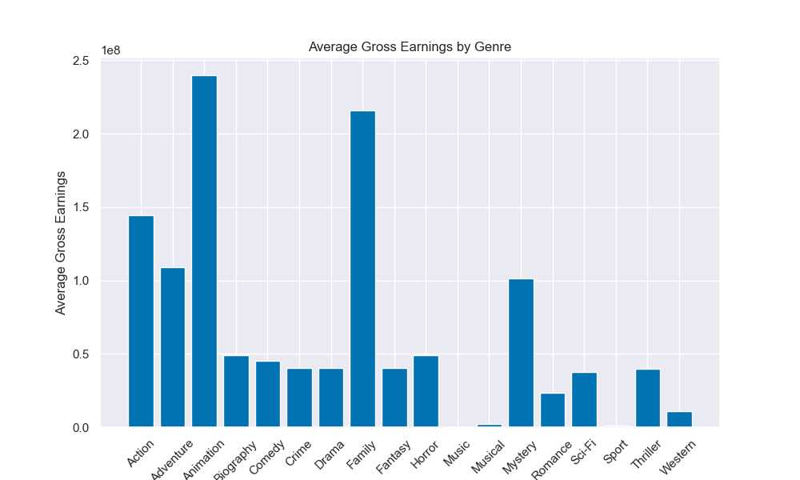

# Film Finance - Exploring Influence on Revenue

## Overview
this project, done using a dataset of different movies with their information such as release, date, year, budget and gross earnings. By analyzing the correlation between budget and gross earnings,I aim to reveal whether higher production costs translate into greater financial success. Additionally, I investigate the average gross earnings by genre, shedding light on which types of films perform best at the box office.

### Tools I Used
Python - Pandas library: to analyse the data. 
         Matplotlib library: to visualize the data.
         Numpy library: to process and calculate data.
Jupyter Notebook - The tool i used to run my Python scripts which let me easily include my notes and analysis.
Git & GitHub - Essentials for version conrol and sharing my Python code and analysis.

## Data Preparation and Cleanup
This section outlines the steps taken to prepare the data for analysis, ensuring accuray and usabilty.

### Import & Clean Up Data
I start by importing necessary libraries, loading and copying the dataset, followed by the initial data cleaning tasks to ensure data quality.

```python
import pandas as pd
import numpy as np
import matplotlib.pyplot as plt
import seaborn as sns
sns.set()

df = pd.read_csv("movies.csv")
df_copy = df.copy()
df_copy.head()

# Dropping missing and nan values from the dataset
df_copy.dropna(subset = ["released"], inplace = True)
df_copy.dropna(subset = ["rating"], inplace = True)
df_copy.dropna(subset = ["writer"], inplace = True)
df_copy.dropna(subset = ["star"], inplace = True)
df_copy.dropna(subset = ["country"], inplace = True)
df_copy.dropna(subset = ["company"], inplace = True)
df_copy["rating"].isna().sum()

df_copy["score"] = df_copy["score"].fillna(df_copy["score"].mean())
df_copy["votes"] = df_copy["votes"].fillna(df_copy["votes"].mean())
df_copy["budget"] = df_copy["budget"].fillna(df_copy["budget"].mean())
df_copy["gross"] = df_copy["gross"].fillna(df_copy["gross"].mean())
df_copy["runtime"] = df_copy["runtime"].fillna(df_copy["runtime"].mean())

# Updating the year column
df_copy['year_correct'] = df_copy['released'].astype(str).str.split().str[2]
df_copy['year_correct']
```
## The Analysis
This project aims at investigating specifics aspects features that may enable a movie to perform well at the box office, taking the correlation of certain features to the gross earned.

### Visualize Data
```python
# Budget vs Gross regression plot
plt.figure(figsize = (10, 8))
sns.regplot(df_copy, 
            x = "budget", 
            y = "gross", 
            scatter_kws = {'color': 'b'}, 
            line_kws = {'color': 'red'})
plt.title("Budget vs Gross Earnings")
plt.savefig('budget-vs-gross-earnings.png')
```
#### Results


#### Insights
The more budget a film has, the higher chance that it is going to be a box office success. Judging by the plot, as the budget increases, the gross also increases.

```python
# Correlation between Budget and Gross plot
correlation_matrix = df_copy.corr(numeric_only = True)
sns.heatmap(correlation_matrix, annot = True)
plt.title("Correlation Matrix for Numeric Features")
plt.xlabel("Movie Features")
plt.ylabel("Movie Features")
plt.savefig('correlation-between-budget-and-gross.png')
plt.show()
```
#### Results 


#### Insights
There is a strong positive correlation between the budget of a movie and it's gross earning, with a correlation coefficient of 0.71. This suggets that higher-budget films tend to generate higher gross revenue.

```python
# Bar plot between Genre and Gross Earnings
plt.figure(figsize=(10, 6))
plt.bar(genre_means['genre'], genre_means['gross'])
plt.xticks(rotation=45)
plt.xlabel('Genre')
plt.ylabel('Average Gross Earnings')
plt.title('Average Gross Earnings by Genre')
plt.savefig('average-gross-by-genre.png')
plt.show()
```
#### Results 


#### Insights
Animation and Family significantly outperform other genres. This suggests that films in these genres tend to have strong commercial appeal, possibly due to their broad audience reach and high production values. 

## What I Learned 
Throughout this project, i deepened my understanding of the financial ascpects of film production and enhanced my skills in Python, especially in data manipulation and visualization. Here are a few specific things i learned:

Data Cleaning Importance: I learned that thorough data cleaning and preparation are crucial before any analysis can be conducted, ensuring the accuracy of insights derived from the data.

## Challenges I Faced
Data Inconsistencies: Handling missing or inconsistent data entries require careful consideration and thorough data cleaning techiques to ensure the integrity of the analysis.

Blancing Breadth and Depth: Deciding how deeply to dive into each analysis while maintaining a broad overview of the data landscape required constant balancing to ensure comprehensive coverage without getting lost in details.

## Conclusion
This analysis provides valuable insights into the dynamics of the film industry by examining the relationship between budget and gross earnings, as well as the average performance of different genres.

My findings indicate a positive correlation between budget and gross earnings, suggesting that higher investment in production often leads to greater financial returns. Additionally, the genre analysis revealed that certain genres, such as Animation, consistently outperform others in terms of box office earnings, highlighting the importance of genre selection in film production.

These insights not only inform production strategies but also offer a data-driven approach for stakeholders in the industry. Ultimately, this project underscores the significance of data analysis in understanding and navigating the complexities of the movie industry, paving the way for more informed decision-making in film production and investment.


